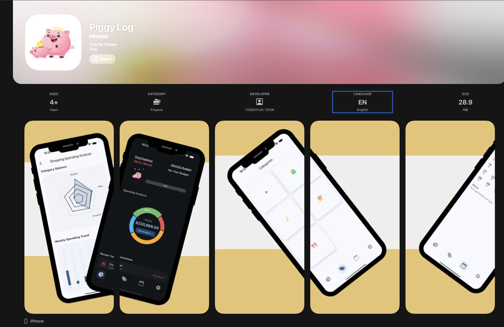

# 🐷 Piggy Log


> 🚀 **Update (2026-01-09)**: **Major Version 1.3.0 Released!**
> 🏗️ **Key Milestone**: Successfully migrated from GetX to **Provider** and implemented a **Feature-based Architecture**. Added In-App Review system and a new Onboarding flow.

<p align="center">
  <strong>Flutter Developer Project – Professional Expense Tracker with Modular Architecture</strong>
</p>

<p align="center">
  
  
  
  
</p>

**Piggy Log** is a production-grade personal finance application. 
It focuses on **performance, architectural integrity, and seamless global usability**.

> 🛠 **Engineering Note**: Version 1.3.0 marks a strategic architectural pivot. We moved away from GetX to a **Provider-based Modular Architecture** to achieve better testability, clearer separation of concerns, and alignment with Flutter's best practices.

---

## 🌟 What's New in v1.3.0

* **🏗️ Architecture Overhaul** – Complete migration to **Provider** and **Feature-based folder structure**.
* **👋 New Onboarding Experience** – Improved first-time user journey with an intuitive guide.
* **⭐ In-App Review System** – Integrated native review prompts to enhance user engagement.
* **🌍 4-Language Localization** – Full support for English, Korean, Japanese, and Thai.
* **📊 Enhanced Data Analytics** – Refined Radar Charts and budget tracking logic for higher precision.

---

## 📲 Official App Store Preview

<p align="center">
  
</p>

*The UI/UX has been fully optimized for a premium financial tracking experience.* 🍎

---

## 📲 Download Now

<p align="left">
  <a href="https://apps.apple.com/app/piggy-log/id6757284836">
    
  </a>
  &nbsp;
  <a href="https://play.google.com/store/apps/details?id=com.terry.piggyLog">
    
  </a>
</p>

*Experience **Piggy Log** today! Check out our live production app on both the App Store and Google Play.*

---

## 📂 Engineering Roadmap: Feature-Based Architecture

Since v1.3.0, the project follows a **Feature-Based Architecture**, grouping code by functional modules to maximize maintainability and scalability.

```text
lib/
├── core/                # Shared infrastructure
│   ├── catalog/         # Category-related assets (colors, icons)
│   ├── database/        # SQLite persistence layer
│   ├── utils/           # Global helpers (App review, snackbars)
│   └── widget/          # Common UI components (Dialogs, splash)
├── data/models/         # Pure Data Entities (Budget, Record, etc.)
├── features/            # Feature-centric modules
│   ├── calendar/        # Calendar view & logic
│   ├── dashboard/       # Main overview & analytics
│   ├── onboarding/      # New user guide experience
│   └── settings/        # App config & reviews
├── providers/           # App-wide state management (Provider)
├── l10n/                # Localization (EN, KO, JA, TH)
├── app.dart             # Root widget & theme configuration
└── main.dart            # Entry point
```
🏗 Technical Design (Update In-Progress)
Logical Data Flow: Refactoring system design to align with Provider-based state management.

Database Schema (ERD): Updating to reflect 1.3.0 normalization. (Scheduled for completion: Monday).

---

🛠 Tech Stack
Framework: Flutter (iOS & Android)

State Management: Provider

Database: SQLite (sqflite)

Charts: fl_chart

Special Features: in_app_review, table_calendar, intl

Modeling Tools: Miro, ERDCloud, Figma

📬 Contact
Terry Yoon – Mobile Developer 📧 yonghyuk.terry.yoon@gmail.com 📍 Vancouver, BC, Canada

💡 North American recruiters: This project demonstrates cross-platform development, strategic architectural migration, multi-language support, and professional-grade database integration.
