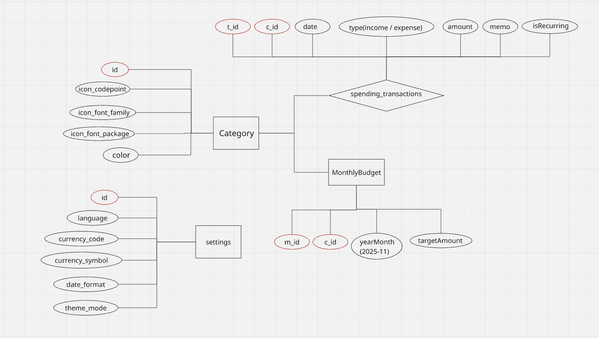
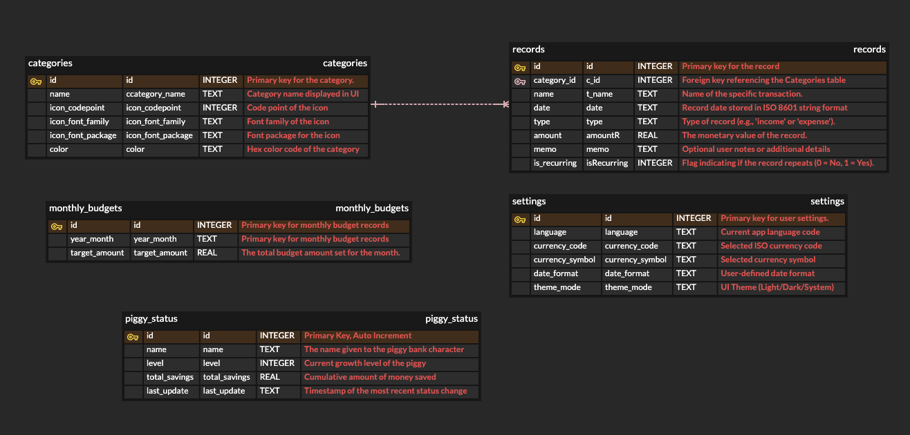

# 🐷 Piggy Log


<p align="center">
  <strong>Intuitive Expense Tracking & Smart Budgeting for a Better Financial Future</strong>
</p>

<p align="center">
  
  
  
  
</p>

**Piggy Log** is a personal finance management application designed for intuitive expense tracking and smart budgeting. It prioritizes data privacy through local storage and provides a seamless user experience across multiple languages.

---

## 🌟 Key Features

* **Multi-Language Support**: Full localization for **English, Korean, Japanese, and Thai**.
* **Budget Management**: Set and track monthly goals by category.
* **Data Visualization**: Insightful charts for spending patterns using `Syncfusion`.
* **Personalization**: Customizable categories with diverse icons and color palettes.

---

## 🎬 Demo Video

[](https://www.youtube.com/watch?v=Ypun7lRNa_o)

*Click the image above to watch the full demo with functional chapters.*

---

## 🏗 Technical Design

To ensure a scalable and robust application, I followed a structured design process from **Logical Planning** to **Physical Modeling**.

### 1. Logical Data Flow (System Design)
I utilized **Miro** to map out the application's logical flow. This step was crucial for visualizing how user interactions, settings, and financial transactions are mapped to maintain clear business logic.



### 2. Database Schema (ERD)
After finalizing the logic, I designed the **Physical Schema** using **ERDCloud**. This diagram is 100% synchronized with the SQLite implementation in the Flutter code.



* **Referential Integrity**: Enforced strict **1:N relationships** between categories and transactions using Foreign Keys (`c_id`).
* **Normalization**: Optimized the schema to eliminate data redundancy and ensure data integrity.
* **Data Accuracy**: Leveraged SQLite-native types (**REAL** for financial precision, **TEXT** for ISO 8601 date formats) to ensure data consistency.

---

## 🎨 UI/UX & Marketing Assets

* **Prototyping**: Designed high-fidelity wireframes and UI components using **Figma** to ensure a user-centric interface.
* **App Marketing**: Created professional promotional assets using **Canva** to enhance the app's visual identity.

---

## 🛠 Tech Stack

* **Framework**: Flutter
* **State Management**: GetX (MVVM Architecture)
* **Database**: SQLite (via `sqflite`)
* **IDE**: VS Code
* **Environment**: iOS/Android Simulators

---

## 📂 Project Structure (MVVM)

```text
lib/
├── controller/  # Reactive UI state management (GetX)
├── l10n/        # Multi-language localization files (EN, KO, JA, TH)
├── model/       # Data entities synchronized with DB schema
├── view/        # UI pages and reusable widgets
└── VM/          # ViewModels & Database Handlers
```


💡 Technical Challenges & Solutions
Challenge: Managing consistent data types between SQLite and Dart.

Solution: Refactored the DatabaseHandler to strictly align with the physical schema, ensuring REAL types for currency to prevent rounding errors during calculations.

📬 Contact
Terry Yoon 📧 yonghyuk.terry.yoon@gmail.com

📍 Vancouver, BC, Canada
