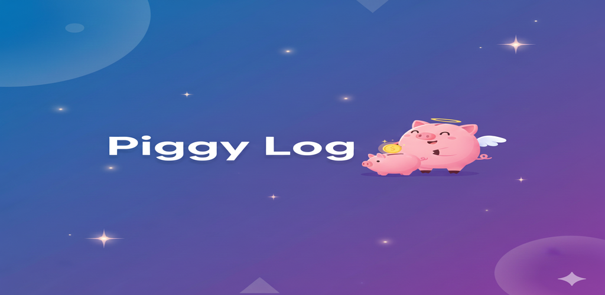

# 🐷 Piggy Log (v1.3.0)



> 🚀 **Quality & Architecture Milestone**: Strategic structural migration from GetX to **Provider** to resolve complex state synchronization anomalies and lock long-term regression stability.

**Piggy Log** is a production-grade personal finance application available on [App Store](https://apps.apple.com/app/piggy-log/id6757284836) and [Google Play](https://play.google.com/store/apps/details?id=com.terry.piggyLog). It focuses on **data integrity, strict exception handling, and seamless localized usability.**

---

## 🔍 QA Focus: 13+ Core Troubleshooting Cases

To ensure production-level stability and full data synchronization, a rigorous test execution and defect tracking workflow was maintained. 

📑 **[Click Here to Read the Full 13+ Technical Defect Logs & QA Verification Log](./QA_TROUBLESHOOTING.md)**
*(Features documentation on state lifecycle mismatches, memory leaks, dynamic locale formatting, and database normalization).*

---

## 🏗️ Architectural Evolution: Why We Migrated

Version 1.3.0 marks a critical adjustment in the system's engineering philosophy. After detecting implicit state leaks and timing anomalies during regression sweeps, we replaced GetX with **Provider** to achieve:

* **Predictable State Auditing**: Shifting from implicit runtime injection to a compiler-safe, traceable explicit model dependency layout.
* **Separation of Concerns**: Implementing a 4-layered pattern (`Service` → `Repository` → `Provider` → `View`) to isolate core computational tracking rules from UI components.
* **Defect Prevention**: Eliminating overlapping asynchronous rendering loops and stabilizing data persistence pipelines.

---

## 📲 Download Now

<p align="left">
  <a href="https://apps.apple.com/app/piggy-log/id6757284836">
    
  </a>
  <a href="https://play.google.com/store/apps/details?id=com.terry.piggyLog">
    
  </a>
</p>

---

## 🛠️ Technical Verification & Blueprints

These blueprints represent the target reference models used to audit data flows and ensure relational constraints during functional verification phases.

### 1. [Logical Architecture](./docs/logical_architecture.png)
* **QA Scope**: Maps out the 4-Layered structure to trace how global setting mutations explicitly propagate down the active display components.

### 2. [Conceptual ERD](./docs/conceptual_ERD.png)
* **QA Scope**: High-level system requirements tracking to confirm the relational integrity of financial business matrices (`Category` ↔ `Record` ↔ `Budget`).

### 3. [Physical DB Schema](./docs/physical_db_schema.png)
* **QA Scope**: SQLite constraint validation schema checking data types, null boundaries, and foreign key stability.

---

## 📂 System Topography

```text
lib/
├── core/                # Infrastructure (Database, Global Utils, Shared Checklists)
├── data/                # Data Layer (Models, Object Parsers, Entity Schemes)
├── features/            # Contextual Modules (Defect Scopes: Calendar, Dashboard)
├── providers/           # Shared ViewModels (Central Source of Truth for Verification)
├── l10n/                # Localization Matrices (EN, KO, JA, TH Test Bed)
└── main.dart            # System Initialization & Environment Profiles
```


🌟 Production Validation Summary
🌍 Robust Localization (l10n): Verified text expansion boundaries for variable string lengths across English, Korean, Japanese, and Thai layout setups.

📊 Data Visualization: Calibrated color rendering charts against Dark Mode assets to maintain WCAG-compliant readability.

💾 Relational Persistence: Hardened local storage setups against unhandled database mapping values to guarantee 0% pointer runtime failures.

📬 Contact
Terry Yoon – QA Engineer / Mobile Specialist
📧 yonghyuk.terry.yoon@gmail.com | 📍 Vancouver, BC, Canada
